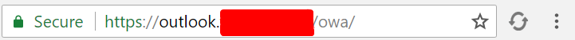

# Outlook Keepalive
A browser extension that prevents the annoying continuous log out from Outlook Web Applications(OWA).

# Installation

## From source
- Go to chrome -> Menu -> More Tools -> Extensions
- Switch on **Developer Mode**
- Click on **Load Unpacked**
- Navigate to the source folder of the extension
- Go to your outlook website, and press the extension icon(_it should turn red_)
- When you close your tab or toggle the extension button while the outlook tab is active, the extension will stop working for that tab.

## Directly from chrome store
- Go to [Chrome store](https://chrome.google.com/webstore/detail/icicklhncnongibfodkagbaiaicmldaf/)
- Click on Add to chrome
- Go to your outlook website, and press the extension icon(_it should turn red_)
- When you close your tab or toggle the extension button while the outlook tab is active, the extension will stop working for that tab.

# Visual

**Inactive**

**Active**

# To Dos
- ~~Release on chrome store.~~
- ~~Use Content scripts to automatically start the keepalive requests.~~
- Make another branch for firefox extension.
- Update the icon when automatically keeping-alive a page.
- Update content script whenever the domain is updated.